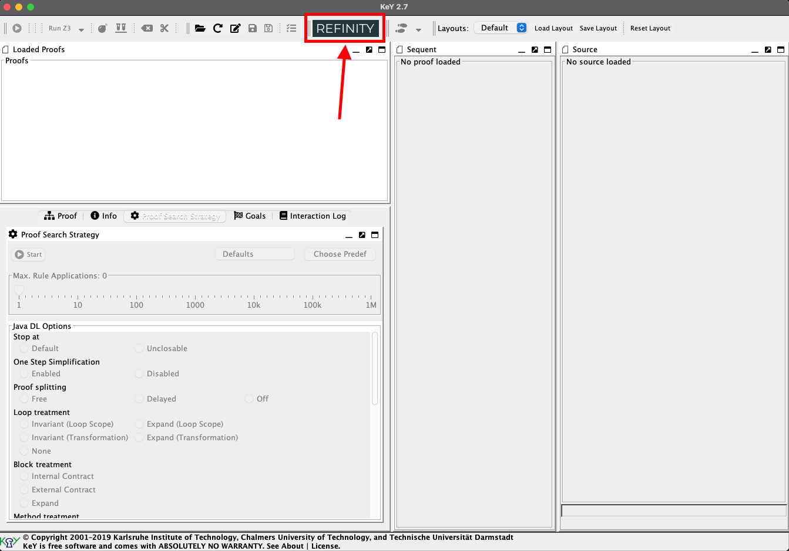
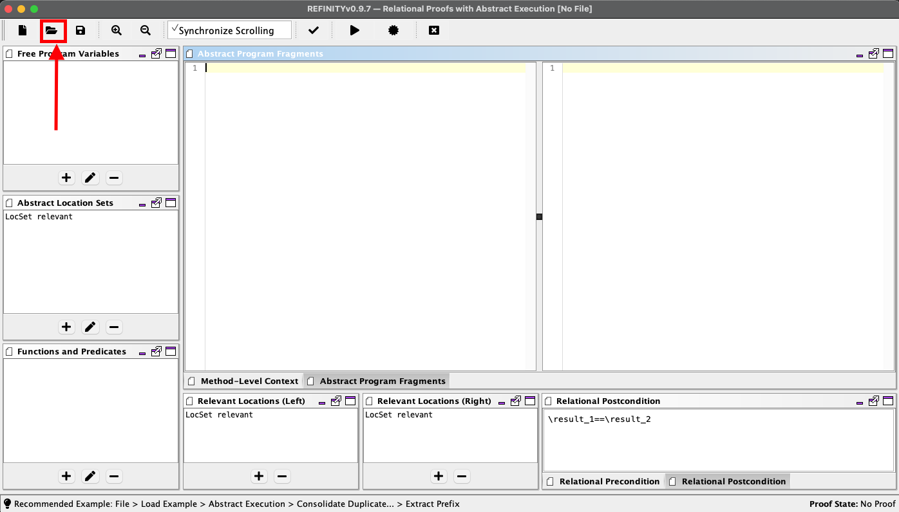
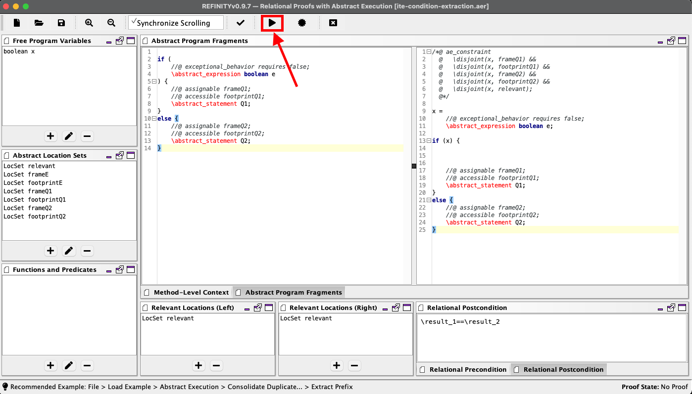

## Delta-based Verification of Software Product Families (Case studies)

## Requirements
Java Version: 8

## Structure of the project-folder

This project contains the case studies for three SPLs:
1. `BankAccountSPL/`
2. `MinePumpPL/`
3. `SimplePL/`

The structure of these folders is similar: they contain the ABS code (`ABS/` folder) and the Java+JML code (`JavaAE/` folder). 

The ABS code itself is not compiled and serves as an outline for the Java implementation. The Java version is used to showcase our approach and each of its contracts can be proven fully automatically by *KeY*. The used Refinity+KeY  version is included as the .jar file `key-2.7-exe.jar`.

Both `ABS/` and `JavaAE/` are structured following the delta-oriented approach with two main folders `core/` and `deltas/`, containing the code for the code and each deltas, respectively.

For both BankAccountSPL and MinePumpPL is also available the original source code in folder `Original/`.

The files of the product-based approach for a subset (only method `timeShift` is considered) of `MinePumpPL` are available in its subfolder `variants-for-evaluation/`, with three subfolders `ABS/` (uncompiled ABS code), `Java/` that contains the code of the product variants, and `cost-and-comparison/` containing the results of the experiments.

An additional folder `transformation_rules/` in the main directory contains four provable transformation rules.

## How to reproduce the results
We refer to the absolute path of this folder as `<PATH>/`.

### Loading the proofs
Given an SPL `<SPL-name>` it is necessary open a terminal open in `<PATH>/`:

#### Loading files

##### Loading core files
To load the proofs for the core of `<SPL-name>` run the following command in the terminal

 ```$ java -jar key-2.7-exe.jar <SPL-name>/JavaAE/core/load.key```

*Example*
To load the proofs for the core of `MinePumpPL` run the command:

```$ java -jar key-2.7-exe.jar MinePumpPL/JavaAE/core/load.key```

##### Loading deltas files
To load the proofs for delta `<delta-name>` of `<SPL-name>` run the command: 

```$ java -jar key-2.7-exe.jar <SPL-name>/JavaAE/deltas/<delta-name>/load.key```

*Example*
To load the proofs for delta `DeltaLowWaterSensor` of `MinePumpPL` run the command:

```$ java -jar key-2.7-exe.jar MinePumpPL/JavaAE/deltas/DeltaLowWaterSensor/load.key```

##### Loading product-variants files
To load the proofs for a product variant `<n_feature-selection>` for `MinePumpPL` run the command (where `n` is used as numeration of the products):

```$ java -jar key-2.7-exe.jar MinePumpPL/variants-for-evaluation/Java/<n_feature-selection>/load.key```

*Example*
To load the proofs for the product variant `7_low_high_alarm` for `MinePumpPL` run the command:

 ```$ java -jar key-2.7-exe.jar MinePumpPL/variants-for-evaluation/Java/7_low_high_alarm/load.key```

#### Selecting proofs
After the execution of each of the previous commands the proof manager should show up as in the following picture:

|  |
| :--: |
|*After selecting load.key for DeltaLowWaterSensor of MinePumpPL*|

On the left side it is possible possible to select the contract to prove and start the proof clicking on "Start Proof".

##### Proving Java+AE
To prove the main contract of a method that contains an abstract statement it is necessary select the first contract of the list for the method called `JML operation contract 0`.

##### Proving Java without AE
If AE is not used in a method there is exactly one contract to be proved for that method.

#### Start proof search
Once the proof is selected it is possible to start the search by pressing the green button:
|  |
| :----------------------------------------------------------: |
| *Before the proof search for `timeShift` for DeltaLowWaterSensor* |

#### The result
At the end of the proof search a windows with the result is displayed:
|  |
| :--: |
|*Result of the proof search for `timeShift` for DeltaLowWaterSensor*|

We are interested into the size of the proof, i.e., the amount of nodes of the proof tree.

### Evaluation
We compared the delta-based results with a product-based approach.
For the evaluation, after loading the proofs for a product variant `<n_feature-selection>`, the method to be proven is `<feature-selection>_timeshift`.

*Example*

1. As shown above to load the proofs for the product variant `7_low_high_alarm` for `MinePumpPL` run the command:

    ```$ java -jar key-2.7-exe.jar MinePumpPL/variants-for-evaluation/Java/7_low_high_alarm/load.key```
2. Select the method `low_high_alarm_timeshift` as below
    |  |
    | :--: |
    |*Selecting version of method `timeShift` for product `low_high_alarm`*|


### Proving transformation rules

1. Open *KeY*, then open *REFINITY*:
    |  |
    | :--: |


2. Select the `.aer` file containing the transformation rule you want to verify:
    |  |
    | :--: |


3. Start the verification:
    |  |
    | :--: |

### Troubleshooting
* If you cannot start KeY or KeY aborts with an exception, it might be the case that you had another KeY version already installed. Please try the following:
1. Go into your home directory
2. Check whether there is folder `.key`
3. Rename or remove this folder